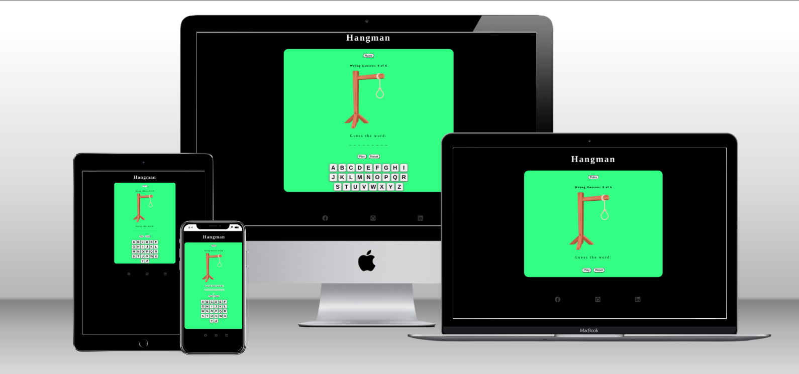
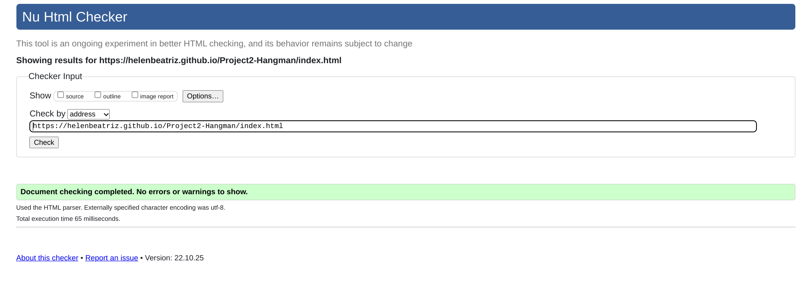
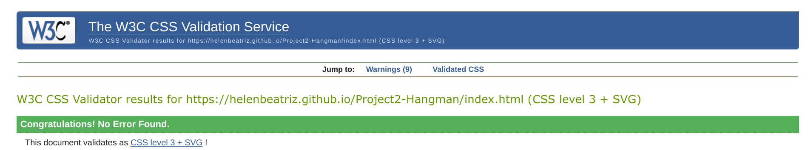
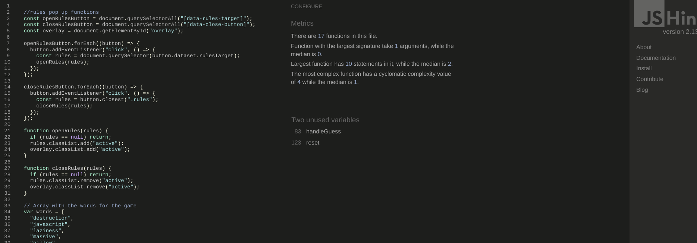

# Hangman

Hangman is a guessing word game. Designed to give the user  fun and at the same time it is a very good game to keep the mind focus on teaching learning process.
How you play : 
 You have got 6 tries to guess the word! 
As letters in the word are guessed, they will be written above the corresponding underline.
 If a letter not in the word is guessed a draw of a man on the gallow–one part for each incorrect letter guess
If you want to try a new word, simply click on the button restart the page and start
again!
View the live site [here](https://helenbeatriz.github.io/Project2-Hangman/index.html)

## UX Design
### User stories 
features that are add in my project saying that the user expects to see when open my website. 
* As a user, I want instructions so that I learn how to play the game.
* As a user, I want a play button so when I click on "Play" I can see it and start playing. 
* As a user, I want a Keyboard so I can see the letters I inserted when guessing the word.
* As a user, I want reset button so that I restart the game when I finish playing it. 
* As a user, I want a visual representation of a Hangman that parts of his body is added for each incorrect letter guess.

### Wireframes

This is how I was planning my website to look like. 
 

### Existing Features

* Responsive game.  
* Rules section.
* Play and reset button.
* 404 Error page.

## Features 

- Hangman game 
- The website contains one full responsive bar that includes links  to play, restart the game and also rules to guide the user through the game
<li>Hangman title </li>
<li>Hangman that is a man that starts to  get  body parts added to the hanging part./li>
<ul>
<li>Play  - to start playing the game</li>
<li>Reset - to reset the game and start a new one </li>
<li>Rules - to guide the user on how to play the game</li>
</ul>
 
 

 

## 404 Page 
A 404 page will be displayed if a user navigates to a broken link.
The 404 page will allow the user to easily go back to the main page cliking on "Return to the main page". 

# How to Play 

* When the user opens the application its expected that he/she opens the instructions section and then play the game click ok 'play', the keyboard is going to show up once that is done.
* Once keyboard is shown user will try to guess the word that is hidden on the game and when the letter does not exists in the word the man's body is going to start showing up on the hanging rope.
* User has 6 chances to make mistakes and then he loses. 
* Once user loses the hangman is going to appear on the screen with a message saying he/she lost.
* If user wins. a message that we won is going to show up.
* User can reset the game for a new word at any time.

- __The Footer__ 

  - The footer contains social feature that link the page to my Linkedin, Github and Facebook.
  - This will allow the users to get in touch with me in case they are interested on my projects.

 

### Features Left to Implement

- Another feature idea.
- Scores Ranking 
- Add more words to the game

## Testing 

I tested the website on different sreen sizes and devices to ensure responsiveness. I tested on Large screen, laptop, iPad Mini, iPhone X, iPhone8, Xiaomi 9, and iPhone SE.

- I had some issues while trying to generate words via another website so I ended up using my own words.
- Had issues running the codes because I wasn't calling the functions.
- I had to resize all the images in order to achieve better responsiveness.
- To achieve the required colour contrast I used the tool Colour Contrast Checker.

### Validator Testing the whole section need to be added but it was already checked -  

- HTML
  - No errors were returned when passing through the official [W3C validator](https://validator.w3.org/nu/?doc=https%3A%2F%2Fhelenbeatriz.github.io%2FCookingacademy-P1%2F) 
  
  
- CSS
  - No errors were found when passing through the official [(Jigsaw) validator](https://jigsaw.w3.org/css-validator/validator?uri=https%3A%2F%2Fhelenbeatriz.github.io%2FCookingacademy-P1%2F&profile=css3svg&usermedium=all&warning=1&vextwarning=&lang=en)
  - Also got good scores on lightroom. 
  

- JSHint 
  -  No potention errors were found on JSHint. 
  - "Reset()" function error is shown as a non called function although it's being called on html.index file.
  - Function "handleGuess()" is being called on te function generateButtons (keyboard).
  
## Deployment

This website was created using Gitpod.

  - This website was deployed to GitHub pages. The steps to deploy are: 
  - Inside Github repository navigate to the Settings tab 
  - From the menu click on 'Pages'
  - From the source section menu, click on the Branch: main
  - Click 'Save'
  - A live link appears on a green tag when published successfully. 

The live link can be found ![here] - (https://helenbeatriz.github.io/Project2-Hangman/index.html)

## Credits 

- Pop up section was found [here] https://www.youtube.com/watch?v=MBaw_6cPmAw
- Hangman pictures  that were used are from [here] https://www.cursoemvideo.com/
- Game logic was created based on [this] tutorial. https://www.youtube.com/watch?v=dgvyE1sJS3Y

### Content 

- Footer icons were taken from [FontAwsome]. https://fontawesome.com/
- Website icon was taken from [Flaticon]. https://www.flaticon.com/
